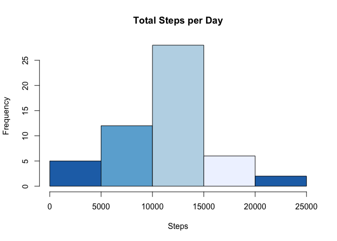
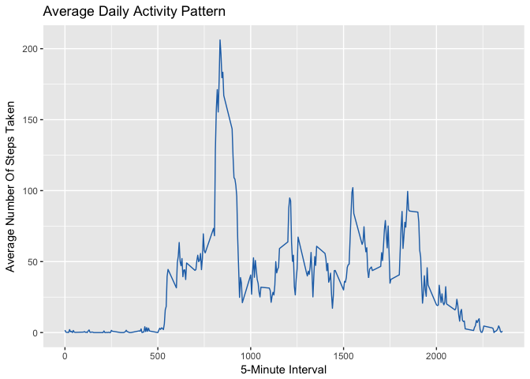
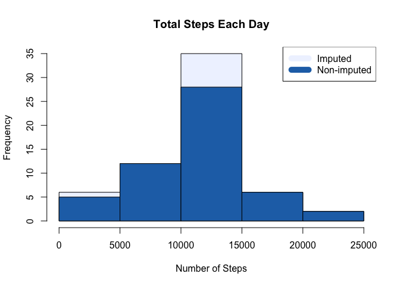
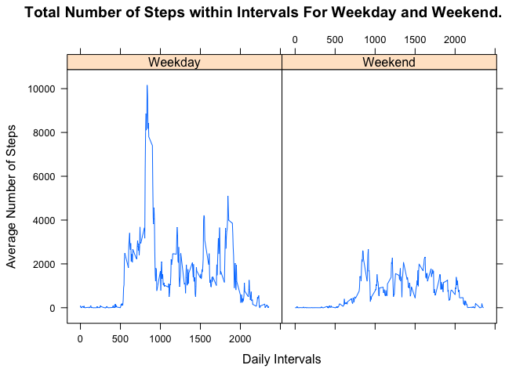

## Loading and preprocessing the data
______________________________________________
*- Loading Library*


```r
library(ggplot2)
library(plyr)
library(lubridate)
```

```
## 
## Attaching package: 'lubridate'
```

```
## The following object is masked from 'package:plyr':
## 
##     here
```

```
## The following object is masked from 'package:base':
## 
##     date
```

```r
library(RColorBrewer)
library(dplyr)
```

```
## 
## Attaching package: 'dplyr'
```

```
## The following objects are masked from 'package:lubridate':
## 
##     intersect, setdiff, union
```

```
## The following objects are masked from 'package:plyr':
## 
##     arrange, count, desc, failwith, id, mutate, rename, summarise,
##     summarize
```

```
## The following objects are masked from 'package:stats':
## 
##     filter, lag
```

```
## The following objects are masked from 'package:base':
## 
##     intersect, setdiff, setequal, union
```

```r
library(lattice)
```

*- Unzipping The File, if does does exists*

```r
if(!file.exists("./activity.csv")){
  unzip(zipfile="activity.zip")
}
```

*- Loading & Cleaning The Data*

```r
activityDataset <- read.csv("activity.csv")


activityDataset$date <- ymd(activityDataset$date)
activityDataset$day <- wday(activityDataset$date, label = TRUE)

# summary shows that there are na's in the steps
summary(activityDataset)
```

```
##      steps             date               interval       day      
##  Min.   :  0.00   Min.   :2012-10-01   Min.   :   0.0   Sun:2304  
##  1st Qu.:  0.00   1st Qu.:2012-10-16   1st Qu.: 588.8   Mon:2592  
##  Median :  0.00   Median :2012-10-31   Median :1177.5   Tue:2592  
##  Mean   : 37.38   Mean   :2012-10-31   Mean   :1177.5   Wed:2592  
##  3rd Qu.: 12.00   3rd Qu.:2012-11-15   3rd Qu.:1766.2   Thu:2592  
##  Max.   :806.00   Max.   :2012-11-30   Max.   :2355.0   Fri:2592  
##  NA's   :2304                                           Sat:2304
```

```r
naOfSteps <- is.na(activityDataset$steps)

#removing the na from the steps
cleanActivityDataset <- activityDataset[!naOfSteps, ]
```

## What is mean total number of steps taken per day?

```r
# sum of steps per day
stepsPerDay <- aggregate(cleanActivityDataset$steps ~ cleanActivityDataset$date, FUN=sum)
names(stepsPerDay) <- c("Date", "Steps")


# Make a histogram of the total number of steps taken each day

# defining the color pallete
cols <- brewer.pal(4, "Blues")
pal <- colorRampPalette(cols)

# Graph
hist(stepsPerDay$Steps, xlab="Steps", main = "Total Steps per Day", col = rev(pal(4)))
```

<!-- -->

Calculate and report the mean and median of the total number of steps taken per day

```r
meanSteps <- as.integer(mean(stepsPerDay$Steps))
medianSteps <- as.integer(median(stepsPerDay$Steps))
```
<i>The mean of steps taken per day is <b>10766</b> & median is <b>10765</b></i>

## What is the average daily activity pattern?

```r
averagesDailyActivity <- aggregate(x=list(steps=cleanActivityDataset$steps), by=list(interval=cleanActivityDataset$interval),
                      FUN=mean)
#graph
ggplot(data=averagesDailyActivity, aes(x=interval, y=steps)) +
    geom_line(color=pal(2)[2]) +
    labs(x= "5-Minute Interval", y = "Average Number Of Steps Taken", title="Average Daily Activity Pattern")
```

<!-- -->

Which 5-minute interval, on average across all the days in the dataset, contains the maximum number of steps?

```r
maxNosSteps <- averagesDailyActivity[which.max(averagesDailyActivity$steps),]$interval
```
<i>The 5-minute interval which had the maximum number of steps was the <b>835</b> interval.</i> 


## Imputing missing values


```r
# Number of na values
totalNosOfNA <- sum(naOfSteps == T)
```
<i>The total number of rows with steps = ‘NA’ is <b>2304</b></i>


```r
# imputed data sorting
incomplete <- sum(!complete.cases(activityDataset))
imputed_data <- transform(activityDataset, steps = ifelse(is.na(activityDataset$steps), averagesDailyActivity$steps[match(activityDataset$interval, averagesDailyActivity$interval)], activityDataset$steps))

# Zeroes were imputed for 10-01-2012 because it was the first day and would have been over 9,000 steps higher than the following day, which had only 126 steps. NAs then were assumed to be zeros to fit the rising trend of the data.
imputed_data[as.character(imputed_data$date) == "2012-10-01", 1] <- 0

stepsPerDayWithNaReplaced <- aggregate(imputed_data$steps ~ imputed_data$date, FUN=sum)
names(stepsPerDayWithNaReplaced) <- c("Date", "Steps")
hist(stepsPerDayWithNaReplaced$Steps, main = paste("Total Steps Each Day"), col=(pal(2)[1]), xlab="Number of Steps")

#Create Histogram to show difference. 
hist(stepsPerDay$Steps, main = paste("Total Steps Each Day"), col=(pal(2)[2]), xlab="Number of Steps", add=T)
legend("topright", c("Imputed", "Non-imputed"), col=c((pal(2)[1]), (pal(2)[2])), lwd=10)
```

<!-- -->


```r
## Mean of Steps with NA data taken care of
replaceNaMean <- as.integer(mean(stepsPerDayWithNaReplaced$Steps))

## Median of Steps with NA data taken care of
replaceNaMedian <-as.integer(mean(stepsPerDayWithNaReplaced$Steps))
```
<i>
The new mean of the imputed data is <b>10589</b> steps compared to the old mean of <b>10766</b> steps. That creates a difference of <b>177</b> steps on average per day.

The new median of the imputed data is <b>10589</b> steps compared to the old median of <b>10765</b> steps. That creates a difference of <b>176</b> steps for the median.

</i>

## Are there differences in activity patterns between weekdays and weekends?

```r
# calculating difference 
averageImputedSteps <- imputed_data %>%
  mutate(weekType = as.factor(ifelse(day %in% c("Sun", "Sat"),
                                             "Weekend", "Weekday"))) %>%
  group_by(weekType, interval) %>%
  summarize(avgStepDay=sum(steps))

#graph
with(averageImputedSteps, 
      xyplot(avgStepDay ~ interval | weekType, 
      type = "l",      
      main = "Total Number of Steps within Intervals For Weekday and Weekend.",
      xlab = "Daily Intervals",
      ylab = "Average Number of Steps")
      )
```

<!-- -->
